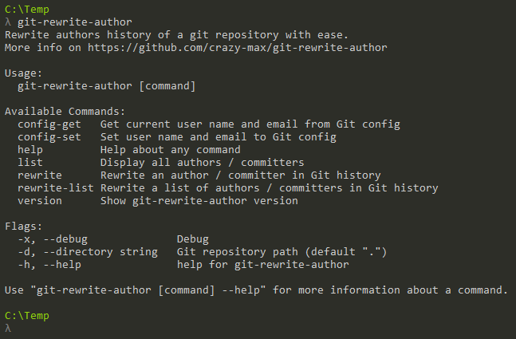

<p align="center"><a href="https://github.com/crazy-max/git-rewrite-author" target="_blank"></a></p>

<p align="center">
  <a href="https://github.com/crazy-max/git-rewrite-author/releases/latest"></a>
  <a href="https://github.com/crazy-max/git-rewrite-author/releases/latest"></a>
  <a href="https://ci.appveyor.com/project/crazy-max/git-rewrite-author"></a>
  <a href="https://goreportcard.com/report/github.com/crazy-max/git-rewrite-author"></a>
  <a href="https://www.codacy.com/app/crazy-max/git-rewrite-author"></a>
  <a href="https://www.paypal.com/cgi-bin/webscr?cmd=_s-xclick&hosted_button_id=WEWXNDUNNE9HU"></a>
</p>

## About

**git-rewrite-author** is a CLI application written in [Go](https://golang.org/) to rewrite one or several authors / committers history of a [Git](https://git-scm.com/) repository with ease. It was inspired by [this post on Github](https://help.github.com/articles/changing-author-info/).


> Screenshot of git-rewrite-author

## Requirements

You must have [Git](https://git-scm.com/) installed on your system and create a fresh, bare clone of your repository :

```
$ cd /tmp
$ git clone --bare https://github.com/user/repo.git
$ cd /tmp/repo.git
```

## Download

| File name                                                                                                                                                    | OS      | Arch    |
| ------------------------------------------------------------------------------------------------------------------------------------------------------------ | ------- | ------- |
| **[git-rewrite-author_darwin_amd64.tar.gz](https://github.com/crazy-max/git-rewrite-author/releases/download/1.1.1/git-rewrite-author_darwin_amd64.tar.gz)** | macOS   | x86-64  |
| [git-rewrite-author_darwin_386.tar.gz](https://github.com/crazy-max/git-rewrite-author/releases/download/1.1.1/git-rewrite-author_darwin_386.tar.gz)         | macOS   | x86     |
| **[git-rewrite-author_linux_amd64.tar.gz](https://github.com/crazy-max/git-rewrite-author/releases/download/1.1.1/git-rewrite-author_linux_amd64.tar.gz)**   | Linux   | x86-64  |
| [git-rewrite-author_linux_386.tar.gz](https://github.com/crazy-max/git-rewrite-author/releases/download/1.1.1/git-rewrite-author_linux_386.tar.gz)           | Linux   | x86     |
| **[git-rewrite-author_linux_arm64.tar.gz](https://github.com/crazy-max/git-rewrite-author/releases/download/1.1.1/git-rewrite-author_linux_arm64.tar.gz)**   | Linux   | ARM64   |
| [git-rewrite-author_linux_arm.tar.gz](https://github.com/crazy-max/git-rewrite-author/releases/download/1.1.1/git-rewrite-author_linux_arm.tar.gz)           | Linux   | ARM     |
| **[git-rewrite-author_windows_amd64.zip](https://github.com/crazy-max/git-rewrite-author/releases/download/1.1.1/git-rewrite-author_windows_amd64.zip)**     | Windows | x86-64  |
| [git-rewrite-author_windows_386.zip](https://github.com/crazy-max/git-rewrite-author/releases/download/1.1.1/git-rewrite-author_windows_386.zip)             | Windows | x86     |

## Installation

Place the executable in your Git repository. It is best to place it in your `PATH` so that you can use it anywhere in your system and also use it with the Git syntax `git rewrite-author`.

## Usage

You probably want to know the list of authors / committers for a repository before rewritting history :

```
$ git-rewrite-author list -d /tmp/repo.git
ohcrap <ohcrap@bad.com>
GitHub <noreply@github.com>
root <root@localhost>
```

Then you can rewrite a single author / committer :

```
$ git-rewrite-author rewrite "ohcrap@bad.com" "John Smith <john.smith@domain.com>" -d /tmp/repo.git

Following authors / committers will be rewritten :
- ohcrap@bad.com => John Smith <john.smith@domain.com

Rewrite 4b03c46d8f085f56014e5bee1e5597de86554139 (31/31) (22 seconds passed, remaining 0 predicted)
Ref 'refs/heads/master' was rewritten
Ref 'refs/remotes/origin/master' was rewritten
Ref 'refs/tags/0.15.1-1' was rewritten
Ref 'refs/tags/0.15.2-2' was rewritten
Ref 'refs/tags/0.15.310-3' was rewritten
Ref 'refs/tags/0.16.9-4' was rewritten
Ref 'refs/tags/0.17.13-5' was rewritten
Ref 'refs/tags/0.17.19-6' was rewritten
Ref 'refs/tags/0.18.14-7' was rewritten
Ref 'refs/tags/0.18.23-8' was rewritten
Ref 'refs/tags/0.18.23-9' was rewritten
Ref 'refs/tags/0.18.36-10' was rewritten
Ref 'refs/tags/0.19.48-11' was rewritten
Ref 'refs/tags/0.19.70-12' was rewritten
```

Or a list of authors / committers :

```
$ git-rewrite-author rewrite-list ../authors.json -d /tmp/repo.git

Following authors / committers will be rewritten :
- root@localhost, noreply@github.com => John Smith <john.smith@domain.com>
- ohcrap@bad.com => Good Sir <goodsir@users.noreply.github.com>

Rewrite 4b03c46d8f085f56014e5bee1e5597de86554139 (31/31) (22 seconds passed, remaining 0 predicted)
Ref 'refs/heads/master' was rewritten
Ref 'refs/remotes/origin/master' was rewritten
Ref 'refs/tags/0.15.1-1' was rewritten
Ref 'refs/tags/0.15.2-2' was rewritten
Ref 'refs/tags/0.15.310-3' was rewritten
Ref 'refs/tags/0.16.9-4' was rewritten
Ref 'refs/tags/0.17.13-5' was rewritten
Ref 'refs/tags/0.17.19-6' was rewritten
Ref 'refs/tags/0.18.14-7' was rewritten
Ref 'refs/tags/0.18.23-8' was rewritten
Ref 'refs/tags/0.18.23-9' was rewritten
Ref 'refs/tags/0.18.36-10' was rewritten
Ref 'refs/tags/0.19.48-11' was rewritten
Ref 'refs/tags/0.19.70-12' was rewritten
```

Here the `authors.json` JSON file looks like this :

```json
[
	{
		"old": [ "root@localhost", "noreply@github.com" ],
		"correct_name": "John Smith",
		"correct_mail": "john.smith@domain.com"
	},
 	{
		"old": [ "ohcrap@bad.com" ],
		"correct_name": "Good Sir",
		"correct_mail": "goodsir@users.noreply.github.com"
	}
]
```

Check if it's okay :

```
$ git-rewrite-author list -d /tmp/repo.git
Good Sir <goodsir@users.noreply.github.com>
John Smith <john.smith@domain.com>
```

Review the new Git history for errors and push the corrected history to Git :

```
git push --force --all
```

## How can i help ?

We welcome all kinds of contributions :raised_hands:!<br />
The most basic way to show your support is to star :star2: the project, or to raise issues :speech_balloon:<br />
Any funds donated will be used to help further development on this project! :gift_heart:

[](https://www.paypal.com/cgi-bin/webscr?cmd=_s-xclick&hosted_button_id=WEWXNDUNNE9HU)

## License

MIT. See `LICENSE` for more details.<br />
Icon credit to [ual Pharm](https://www.shareicon.net/author/ual-pharm).
